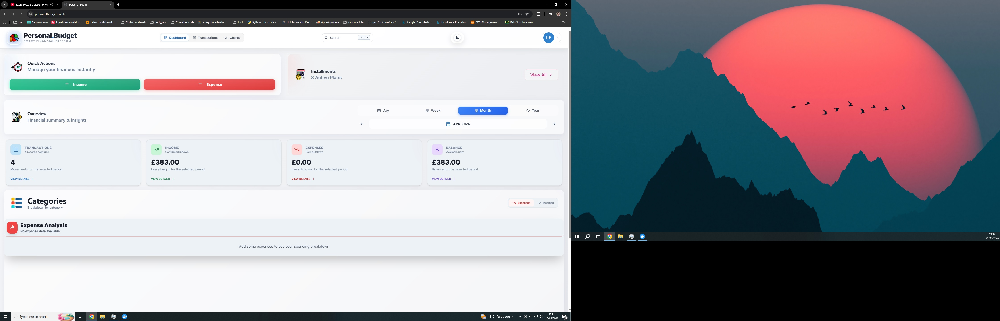
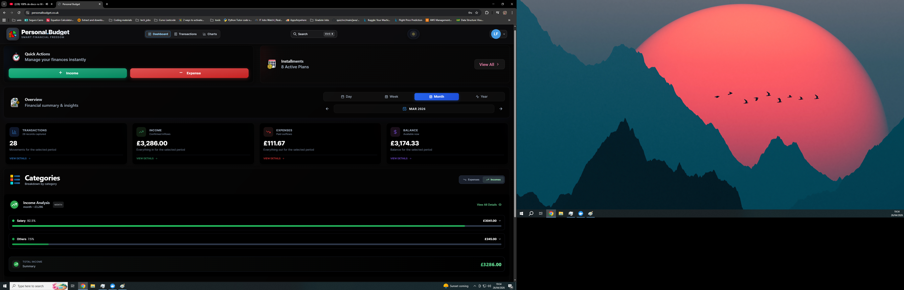

# Personal Budget v2

Personal Budget v2 is a full-stack personal finance management app. It brings together a dashboard, income and expense tracking, instalment plans, recurring payments, payment methods, reports and user administration in a responsive interface.

Live site: https://personalbudget.co.uk

## Overview

- Frontend built with React 18, TypeScript and Vite, using Chakra UI, Recharts, Framer Motion and Lucide/Phosphor icons.
- Backend built with Spring Boot 3.3, Java 17, Spring Security, JWT, Spring Data JPA, Flyway and PostgreSQL.
- Redis cache for user lists, instalment plans, recurring transactions and financial summaries.
- Containerised deployment with Docker, Docker Compose and Nginx.
- Email/password and Google Sign-In authentication, with administrator approval for new accounts.

## Key Features

- Financial dashboard with income, expense, balance and period navigation for day, week, month and year views.
- User-owned current, savings, cash and credit accounts with anchored balances and internal transfers.
- Negative current-account balances and overdraft limits with usage and availability indicators.
- Safe legacy transaction association: existing rows remain intact and unassigned until explicitly linked.
- Savings goals with progress tracking and contributions.
- Monthly category budgets with usage alerts.
- 30/60/90-day cash-flow projections and a future payment calendar.
- Transaction creation, editing, deletion and search by text, type, category and period.
- Fast income and expense entry with an optimised form, number pad and reusable categories.
- Instalment plan management with automatic monthly transaction generation and plan history.
- Fixed and recurring payments with scheduled transaction generation and cancellation that preserves history.
- User-owned payment methods: cash, debit card, credit card and bank transfer.
- Credit card billing logic using statement closing day and payment day to calculate the financial impact date.
- CSV transaction import with per-row validation, preview and downloadable template.
- CSV export for all user transactions.
- Reports by day, week, month or year, including KPIs, insights, categories, payment methods and PDF export.
- Category analysis for income and expenses, with charts and breakdowns.
- Discover section with financial insights, alerts and analysis cards.
- Admin panel for approving registrations, rejecting/removing users and switching Standard/Premium plans.
- Light/dark theme, responsive layout, landing page and polished modal workflows.
- Health check at `/health` and Springdoc OpenAPI documentation when enabled at runtime.

## Technology Stack

### Frontend

- React 18 + TypeScript
- Vite 5
- Chakra UI + Emotion
- Recharts
- Framer Motion
- Axios
- Zod
- Lucide React, Phosphor Icons and React Icons

### Backend

- Java 17
- Spring Boot 3.3
- Spring Web
- Spring Security + JWT
- Spring Data JPA
- PostgreSQL 16
- Flyway
- Redis + Spring Cache
- Springdoc OpenAPI
- Google API Client for Google Sign-In
- Apache PDFBox for PDF generation
- JUnit/Spring Boot Test

### Infrastructure and Deployment

- Docker and Docker Compose
- Nginx for serving the frontend and proxying `/api`
- Vercel configuration for the frontend
- Helper scripts for VPS, Nginx and SSL setup

## Architecture

```text
frontend/                 React + TypeScript + Vite
  src/pages/              Dashboard, transactions, categories, reports, admin and landing
  src/components/         UI, layout, auth, transactions, charts, search and user components
  src/sections/           Main dashboard sections
  src/hooks/              Data loading, filters, period navigation, insights and categories
  src/contexts/           AuthContext and SearchContext

backend/                  Spring Boot API
  src/main/java/.../controller
  src/main/java/.../service
  src/main/java/.../repository
  src/main/java/.../model
  src/main/resources/db/migration

docs/                     Additional technical documentation
docker-compose*.yml       Local, development and production environments
```

High-level flow:

1. The user opens the landing page or authenticates through the auth modal.
2. The frontend stores the JWT and sends `Authorization: Bearer <token>` with Axios requests.
3. The backend validates the token, scopes data to the authenticated user and persists it in PostgreSQL.
4. Flyway keeps the schema versioned and Redis speeds up lists and summaries.
5. Nginx serves the frontend build and forwards `/api` requests to the backend in Docker environments.

## Getting Started with Docker

Create a local `.env` file from the example:

```bash
cp env.example .env
```

Set at least:

```env
DB_NAME=personalbudget
DB_USER=postgres
DB_PASSWORD=change-me
JWT_SECRET=change-me
JWT_EXPIRATION=86400000
GOOGLE_OAUTH_CLIENT_ID=
VITE_GOOGLE_CLIENT_ID=
REDIS_HOST=redis
REDIS_PORT=6379
```

Start the development environment:

```bash
docker compose -f docker-compose.dev.yml up -d --build
```

Main services:

- Frontend: http://localhost:3000
- Backend: http://localhost:8080
- PostgreSQL: `localhost:5432`
- Redis: `localhost:6379`

Stop the stack:

```bash
docker compose -f docker-compose.dev.yml down
```

## Local Development

### Backend

Requirements: Java 17, Maven, PostgreSQL and Redis.

```bash
cd backend
mvn spring-boot:run
```

The backend reads `DB_HOST`, `DB_PORT`, `DB_NAME`, `DB_USER`, `DB_PASSWORD`, `JWT_SECRET`, `JWT_EXPIRATION`, `REDIS_HOST`, `REDIS_PORT` and `GOOGLE_OAUTH_CLIENT_ID`.

### Frontend

Requirements: Node.js 18+ and npm.

```bash
cd frontend
npm install
npm run dev
```

By default, the frontend uses `/api` and Vite proxies requests to the backend. If you point it directly at an external API, set `VITE_API_URL` with the `/api` prefix, for example:

```env
VITE_API_URL=http://localhost:8080/api
```

## Useful Scripts

Frontend:

```bash
npm run dev
npm run build
npm run preview
```

Backend:

```bash
mvn test
mvn clean verify
mvn spring-boot:run
```

Docker:

```bash
docker compose -f docker-compose.dev.yml up -d --build
docker compose -f docker-compose.prod.yml up -d --build
```

## Main API

All routes below require a JWT, except `/api/auth/**` and `/health`.

- `POST /api/auth/register`
- `POST /api/auth/login`
- `POST /api/auth/google`
- `POST /api/auth/reset-password`
- `GET /api/transactions`
- `POST /api/transactions`
- `PUT /api/transactions/{id}`
- `DELETE /api/transactions/{id}`
- `GET /api/transactions/search`
- `POST /api/transactions/import`
- `GET /api/transactions/export`
- `GET /api/summary/month`
- `GET /api/payment-methods`
- `POST /api/payment-methods`
- `PUT /api/payment-methods/{id}`
- `DELETE /api/payment-methods/{id}`
- `GET /api/accounts/summary`
- `POST /api/accounts`
- `POST /api/accounts/transfers`
- `POST /api/accounts/{id}/assign-legacy-transactions`
- `GET /api/goals`
- `POST /api/goals`
- `POST /api/goals/{id}/contributions`
- `GET /api/planning/budgets`
- `PUT /api/planning/budgets`
- `GET /api/planning/forecast`
- `GET /api/installment-plans`
- `POST /api/installment-plans`
- `PUT /api/installment-plans/{id}`
- `DELETE /api/installment-plans/{id}`
- `GET /api/recurring-transactions`
- `POST /api/recurring-transactions`
- `PATCH /api/recurring-transactions/{id}/amount`
- `PUT /api/recurring-transactions/{id}`
- `DELETE /api/recurring-transactions/{id}`
- `GET /api/reports`
- `GET /api/reports/pdf`
- `GET /api/admin/users`
- `PATCH /api/admin/users/{id}/approve`
- `PATCH /api/admin/users/{id}/plan`
- `DELETE /api/admin/users/{id}`
- `GET /health`

See [docs/API.md](docs/API.md) for more detail.

## Database

The schema is versioned with Flyway in `backend/src/main/resources/db/migration`.

Main entities:

- `users`
- `transactions`
- `installment_plan`
- `recurring_transactions`
- `payment_methods`
- `financial_accounts`
- `account_transfers`
- `savings_goals`
- `savings_goal_contributions`
- `category_budgets`

The model separates `transaction_date` from `payment_date`, allowing credit card purchases to affect the budget on the correct statement/payment date.

## Tests

The backend includes service tests for authentication, transactions, instalment plans, recurring payments, reports and credit card billing calculations:

```bash
cd backend
mvn test
```

The backend Dockerfile runs `mvn clean verify` by default during the build. For faster local image builds:

```bash
docker build --build-arg SKIP_TESTS=true ./backend
```

## Additional Documentation

- [Architecture](docs/ARCHITECTURE.md)
- [Backend](docs/BACKEND.md)
- [Frontend](docs/FRONTEND.md)
- [API](docs/API.md)
- [Deployment](docs/DEPLOYMENT.md)
- [Docker](DOCKER_README.md)
- [Deployment README](README_DEPLOY.md)
- [Vercel](VERCEL_CONFIG.md)
- [VPS](VPS_SETUP.md)
- [Instalment Plans](backend/INSTALLMENT_PLANS_README.md)
- [Performance](backend/PERFORMANCE_ANALYSIS.md)
- [Profiles](backend/PROFILES_README.md)
- [PostgreSQL](backend/POSTGRESQL_SETUP.md)

## Screenshots






## Licence

MIT - see [LICENSE](LICENSE).
